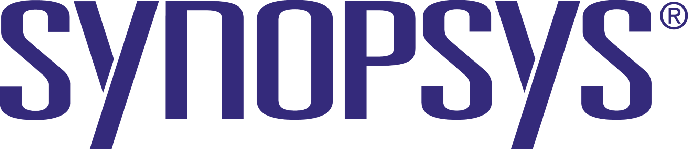
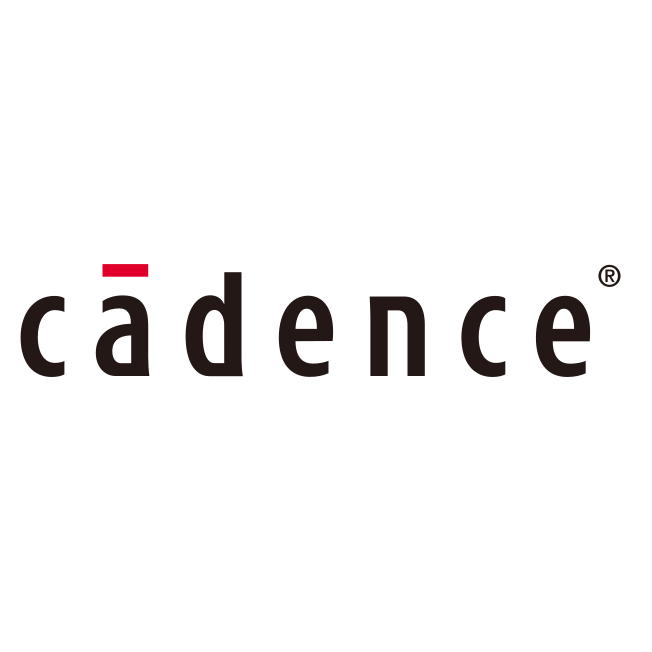
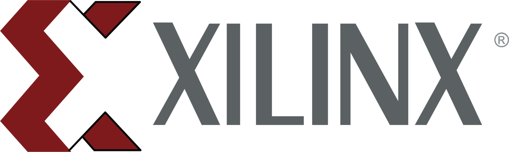
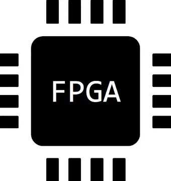
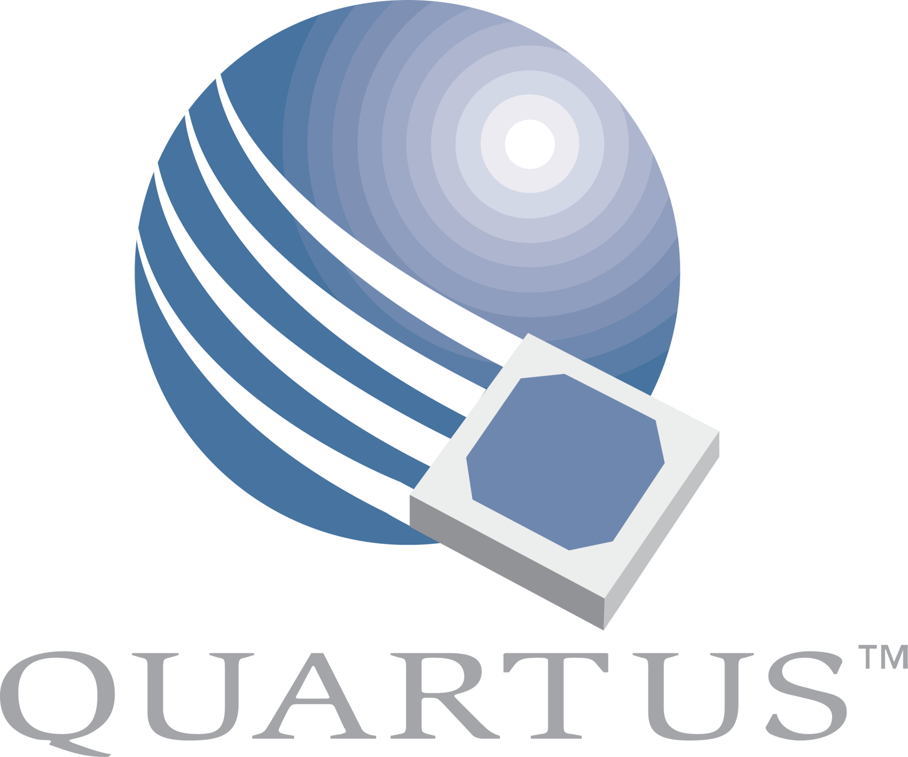

<div align="center">


# 👋 Hi, I'm Aadarsh K A S


<br>

**IIT PALS InnoWAH Runner-up** &nbsp;•&nbsp; **SIH '26 Finalist** &nbsp;•&nbsp; **Lam Research Qualified** &nbsp;•&nbsp; **IEEE Published**

</div>

---

## 🎯 About Me

Hardware engineer who thinks in systems—from RTL code to the product a user holds. Currently deepening VLSI expertise while staying hands-on with embedded systems and IoT product development.

- 🔭 **Currently**: VLSI Intern @ **Struent Semiconductor**
- 💼 **Previously**: R&D Intern @ Spinacle Technologies &nbsp;|&nbsp; Drone Engineer @ Big Bang Boom Solutions
- 🎓 **Studying**: Electronics Engineering (VLSI) @ Rajalakshmi Institute of Technology
- 👨‍🏫 **Mentor**: 50+ students on systems thinking & product development
- 💡 **Superpower**: I find root causes others miss—hardware depth meets product strategy

---

## 🔬 What I Work On

```
Silicon Layer      →   RTL Design  ·  RISC-V  ·  SoC Architecture  ·  FPGA  ·  Digital Circuits
Physical Design    →   Synthesis   ·  P&R      ·  DRC/LVS          ·  GDSII Generation
Embedded Layer     →   Firmware    ·  Sensors  ·  Motor Control     ·  Real-time Systems
Product Layer      →   IoT Devices ·  MVP Dev  ·  PCB Design        ·  Hardware to Cloud
```

---

## 💼 Experience

<div align="center">

<table border="0" cellpadding="12" cellspacing="0" width="100%">

<tr>
<td>
<b>Struent Semiconductors</b> &nbsp;·&nbsp; Student Intern &nbsp;&nbsp;
<code>Apr 2026 – Present</code><br>
Studying and applying digital circuit design fundamentals — combinational/sequential logic, hardware integration, RTL coding — under industry mentorship using professional EDA tools.
</td>
</tr>

<tr><td><br></td></tr>

<tr>
<td>
<b>Big Bang Boom Solutions</b> &nbsp;·&nbsp; Drone Engineer Intern &nbsp;&nbsp;
<code>Jun – Sep 2025</code><br>
Contributed to electronics integration, sensor calibration, and field testing of defense-grade UAV platforms, supporting flight stability validation and mission readiness assessments.
</td>
</tr>

<tr><td><br></td></tr>

<tr>
<td>
<b>Spinacle Technologies Pvt. Ltd.</b> &nbsp;·&nbsp; R&D Intern &nbsp;&nbsp;
<code>Jan – Jun 2025</code><br>
• Designed multi-layer PCBs in Altium Designer optimized for power and area in resource-constrained healthcare IoT environments.<br>
• Developed ESP32 embedded firmware in Embedded C for an IoT MVP, enabling real-time multi-sensor data acquisition and processing.
</td>
</tr>

<tr><td><br></td></tr>

<tr>
<td>
<b>Spinacle Technologies Pvt. Ltd.</b> &nbsp;·&nbsp; AIoT Intern &nbsp;&nbsp;
<code>Apr – May 2024</code><br>
Built an ESP32-based audio monitoring system integrated with Microsoft Azure, reducing alert latency by 10% vs. prior pipeline.
</td>
</tr>

</table>

</div>

---
🚀 Projects
<div align="center">
<table border="0" cellpadding="12" cellspacing="0" width="100%">
<tr>
<td>
<b>Custom 130nm CMOS NOT Gate — RTL-to-GDSII</b> &nbsp;·&nbsp;
<sub><code>SkyWater 130nm PDK · OpenLane 2</code></sub><br>
Designed DRC/LVS-clean GDSII layout via OpenLane 2 (Yosys + OpenROAD); 50×50 µm footprint with West-In/East-Out pin ordering for modular hierarchical integration.
</td>
</tr>
<tr><td><br></td></tr>
<tr>
<td>
<b>On-Chip Tsetlin Machine</b> &nbsp;·&nbsp;
<sub><code>Renesas Forge SLG47910 FPGA · Verilog-2001</code></sub><br>
- Binary classifier on 1K-LUT FPGA; LFSR-gated stochastic automaton with 12-clause voting solving the non-linearly separable XOR problem.<br>
- Designed an RP2040-based MicroPython supervisor that streamed training data over a 6-pin GPIO interface and automatically stopped training upon convergence — hardware-software co-design for edge ML.
</td>
</tr>
<tr><td><br></td></tr>
<tr>
<td>
<b><a href="https://github.com/aadarsh2812/Vga_Pong_Game">Hardware-Driven VGA Pong</a></b> &nbsp;·&nbsp;
<sub><code>Altera DE2 FPGA · Verilog RTL</code></sub><br>
Pure RTL VGA Pong — no CPU, no software. 640×480 VGA output with real-time physics, collision detection, score tracking, and synchronous game state machine.
</td>
  <tr>
<td>
<b><a href="https://iit-pals.vercel.app/#demo">Mento — Predict Injuries & Prevent it.</a></b> &nbsp;·&nbsp;
<sub><code>Wearable · Edge ML · LSTM · Multi-Sensor Fusion</code></sub><br>
Real-time wearable system that predicts sports injuries before they happen — using multi-sensor fusion, edge computing, and an LSTM trained on continuous biometric streams.
</td>
</tr>
<tr><td><br></td></tr>
</tr>
<tr><td><br></td></tr>
<tr>
<td>
<b><a href="https://github.com/aadarsh2812/Muscle-sync">MuscleSync — Real-Time EMG-Based Control System</a></b><br>
Embedded C firmware for EMG signal acquisition and digital filtering; 85% pattern-recognition accuracy for assistive control applications. Flex a muscle, control your PC — no touch needed.
</td>
</tr>
<tr><td><br></td></tr>
<tr>
<td>
<b>Gut Health Management System</b> &nbsp;·&nbsp;
<sub><code>Raspberry Pi · Cloud AI</code></sub><br>
Non-invasive gut health monitoring system using Raspberry Pi; captured multimodal data (image + audio), processed via cloud AI, achieving 80% diagnostic detection accuracy.
</td>
</tr>
</table>
</div>

## 🏆 Achievements

<div align="center">

| Achievement | Details |
|:---|:---|
| 🥈 **IIT PALS InnoWAH Runner-up** | MedTech Track · 2026 |
| 🏅 **Smart India Hackathon Finalist** | Wearable · Sports & Health · 2026 |
| 🎓 **1-TOPS Program** | Top 100 Team · 2026 |
| 🔬 **Lam Research Challenge** | Systems Engineering · IISc · 2023 |
| 📄 **IEEE Publication** | ICPECTS Conference · 2024 |
| 🏆 **IoT Excellence Award** | Outstanding Technical Contributions · 2024 |

</div>

---

## 💻 Languages & Tools

<div align="center">

### Programming & Frameworks


<br>

### Platforms & DevTools


</div>

---

## 🔌 Hardware & RTL

<div align="center">


&nbsp;

&nbsp;

&nbsp;

&nbsp;

&nbsp;


</div>

---

## 🛠️ EDA & Simulation Tools

<div align="center">

<table border="0" cellpadding="16" cellspacing="0">
<tr>
<td align="center" width="150">
<br><br>
<b>Synopsys</b><br>
<sub>VCS · Verdi · Fusion Compiler</sub>
</td>
<td align="center" width="150">
<br><br>
<b>Cadence</b><br>
<sub>Cadence Virtuoso</sub>
</td>
<td align="center" width="150">
<br><br>
<b>Xilinx Vivado</b><br>
<sub>AMD FPGA Design</sub>
</td>
<td align="center" width="150">
<br><br>
<b>LTspice</b><br>
<sub>Circuit Simulation</sub>
</td>
<td align="center" width="150">
<br><br>
<b>EasyEDA</b><br>
<sub>PCB & Schematic</sub>
</td>
<td align="center" width="150">
<br><br>
<b>FPGA Design</b><br>
<sub>Xilinx · Intel · Lattice</sub>
</td>
<td align="center" width="150">
<br><br>
<b>Intel Quartus</b><br>
<sub>FPGA Programming</sub>
</td>
</tr>
</table>

</div>

---

## 📊 GitHub Stats

<div align="center">


<br>


</div>

---

## 🤝 Looking to Collaborate On

VLSI/FPGA projects &nbsp;•&nbsp; Embedded systems & IoT products &nbsp;•&nbsp; RTL design challenges &nbsp;•&nbsp; Hardware-software integration &nbsp;•&nbsp; Anything needing systems thinking + strategic execution

---

## 📫 Connect with me:

<div align="center">

<a href="https://github.com/aadarsh2812" target="_blank">

</a>
&nbsp;&nbsp;&nbsp;&nbsp;
<a href="https://linkedin.com/in/aadarshkas2812" target="_blank">

</a>
&nbsp;&nbsp;&nbsp;&nbsp;
<a href="https://instagram.com/i_.aadarsh" target="_blank">

</a>
&nbsp;&nbsp;&nbsp;&nbsp;
<a href="mailto:kasaadarsh@gmail.com" target="_blank">

</a>
&nbsp;&nbsp;&nbsp;&nbsp;
<a href="https://i-aadarshkas.web.app/" target="_blank">

</a>

</div>

---

## ⚡ Fun Fact

> I debug hardware with a product mindset and build products with a hardware engineer's constraints—turns out thinking vertically solves problems others miss.

---

<div align="center">

*"Strategy is my unfair advantage. I find problems worth solving while others chase solutions."*

<br>


**📍 Chennai, India &nbsp;•&nbsp; 🎓 Electronics Engineering (VLSI) &nbsp;•&nbsp; 🚀 Open to Opportunities**

</div>
